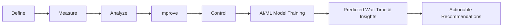

# 🏥 Hospital Wait Time Prediction & Optimization

## 📌 Overview
This project aims to **predict hospital wait times** and provide **data-driven recommendations** to healthcare organisations on how to **reduce wait times** using **Six Sigma**, **DMAIC**, and **AI/ML techniques**.  
Our ultimate goal is to improve **patient experience**, **operational efficiency**, and **resource allocation**.

---

## 🎯 Objectives
1. Predict **total patient wait time** based on operational and patient-related factors.
2. Identify the **key contributors** to longer wait times.
3. Suggest actionable strategies to **reduce delays** using:
   - **Six Sigma** methodology
   - **DMAIC** (Define, Measure, Analyze, Improve, Control)
   - **AI/ML insights**

---

## 🛠 Methodology
- **Data Analysis** – Understand patterns, trends, and bottlenecks.
- **Feature Engineering** – Encode categorical variables, handle missing data, normalize numerical features.
- **Modeling** – Train regression models to predict wait time.
- **Six Sigma + DMAIC** – Leverage ML outputs to define process improvement actions.

---

## 🔄 Six Sigma + ML Pipeline

---

## 📈 Expected Outcomes

* Accurate predictions for wait times.
* Feature importance analysis to identify key delay factors.
* Practical, actionable strategies for reducing wait times.
* Integration of **AI/ML with Six Sigma principles** for sustainable improvements.

---

**Status:** 🚧 In Progress – Model selection and tuning underway.

